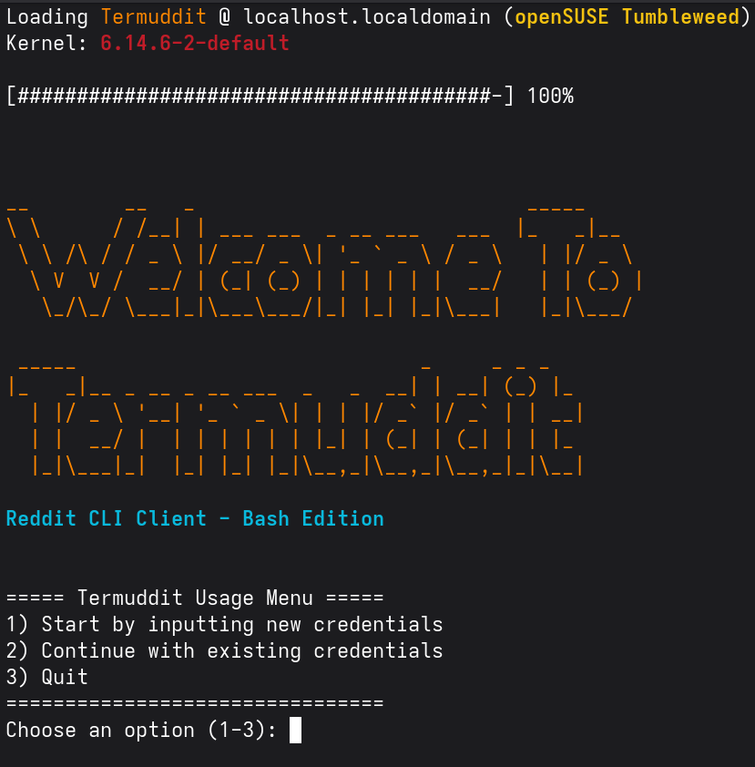

# Termuddit - Reddit CLI Client

A command-line interface Reddit client written in Bash that lets you browse Reddit from your terminal with a clean, colorful interface.



## Features

- 🎨 Colorful and clean terminal interface
- 👀 Browse subreddits and view posts
- 💬 View nested comments with proper threading
- 🔄 Refresh posts and comments
- 🎯 Load more comments on demand
- 🔒 Secure credential management
- 🚀 Fast and lightweight

## Prerequisites

- Bash 4.0+
- `curl`
- `jq` (JSON processor)
- `figlet` (for splash screen)
- Reddit API credentials

## Installation

1. Clone the repository:
```bash
git clone https://github.com/yourusername/termuddit.git
cd termuddit
```

2. Make scripts executable:
```bash
chmod +x *.sh
```

3. Install dependencies (Ubuntu/Debian):
```bash
sudo apt install jq curl figlet
```

## Setup

1. Create a Reddit App:
   - Go to https://www.reddit.com/prefs/apps
   - Click "Create App" or "Create Another App"
   - Select "script"
   - Fill in the required information
   - Note your Client ID and Client Secret

2. Run Termuddit:
```bash
./termuddit.sh
```

3. Enter your Reddit API credentials when prompted

## Usage

1. Start the application:
```bash
./termuddit.sh
```

2. Enter a subreddit name when prompted (e.g., "linux", "programming")

3. Choose number of posts to fetch

### Navigation

- Enter post number to view its comments
- `r` - Refresh posts
- `q` - Return to main menu

### Comment View

- `m` - Load more comments
- `r` - Refresh current comments
- `q` - Return to posts view

## Project Structure

```
termuddit/
├── termuddit.sh      # Main script
├── authenticate.sh    # Reddit API authentication
├── get_posts.sh      # Post fetching and display
├── get_comments.sh   # Comment fetching and display
└── splash.sh         # Splash screen
```

## Security

- Credentials are stored locally in `credentials.txt`
- Access token is stored in `access_token.txt`
- Both files are git-ignored

## Contributing

1. Fork the repository
2. Create your feature branch
3. Commit your changes
4. Push to the branch
5. Create a Pull Request

## License

This project is licensed under the GNU General Public License v3.0 - see the [LICENSE](LICENSE) file for details.

## Acknowledgments

- Reddit API Documentation
- JQ Manual
- Bash Documentation

## Author

- WeWeBunnyX ([@WeWeBunnyX](https://reddit.com/u/WeWeBunnyX))

## Support

If you found this project helpful, please give it a ⭐️!

## Contributing

Contributions are welcome, you may open a pull request or submit an issue. 
