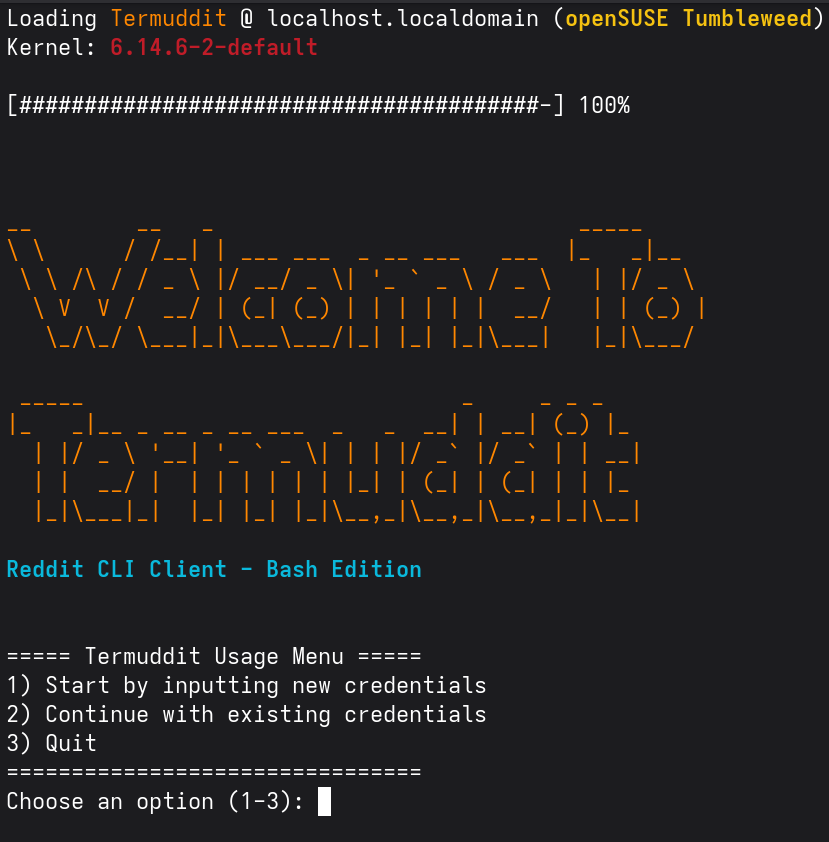
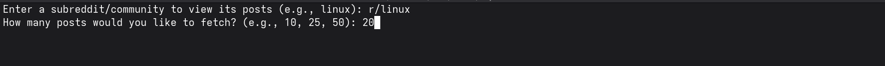
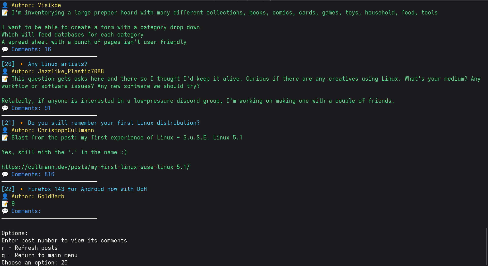
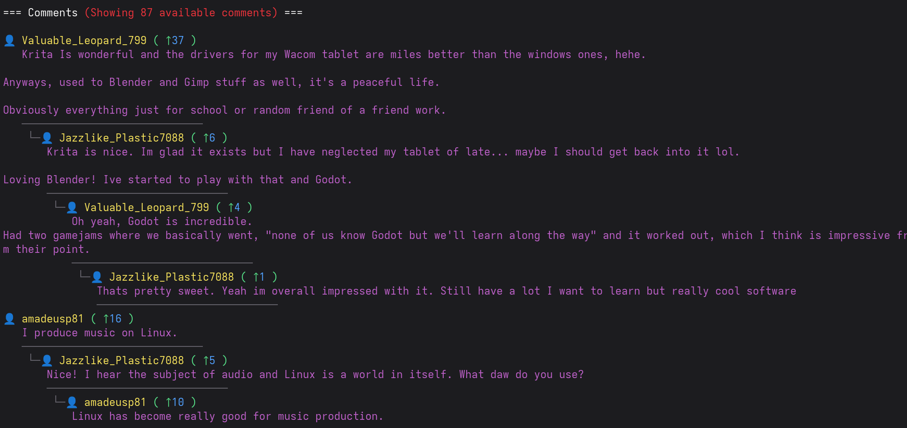

# Termuddit - Reddit CLI Client

A command-line interface Reddit client written in Bash that lets you browse Reddit from your terminal with a clean, colorful interface.






## Features

- 🎨 Colorful and clean terminal interface
- 👀 Browse subreddits and view posts
- 🖼️ View images as ASCII art in terminal
- 💬 View nested comments with proper threading
- 🔄 Refresh posts and comments
- 🎯 Load more comments on demand
- 🔒 Secure credential management
- 🚀 Fast and lightweight

## Prerequisites

- Bash 4.0+
- `curl`
- `jq` (JSON processor)
- `figlet` (for splash screen)
- `chafa` (for ASCII art images)
- Reddit API credentials

## Installation

1. Clone the repository:
```bash
git clone https://github.com/WeWeBunnyX/termuddit.git
cd termuddit
```

2. Make scripts executable:
```bash
chmod +x *.sh
```

3. Install dependencies:

### Ubuntu/Debian
```bash
sudo apt install jq curl figlet chafa
```

### Fedora/RHEL
```bash
sudo dnf install jq curl figlet chafa
```

### Arch Linux
```bash
sudo pacman -S jq curl figlet chafa
```

### macOS (using Homebrew)
```bash
brew install jq curl figlet chafa
```

### Using Package Manager Alternatives
| Distribution | Package Manager | Command |
|-------------|----------------|---------|
| OpenSUSE    | zypper         | `sudo zypper install jq curl figlet chafa` |
| Alpine      | apk            | `sudo apk add jq curl figlet chafa` |
| Gentoo      | emerge         | `sudo emerge jq curl figlet chafa` |
| Void Linux  | xbps           | `sudo xbps-install -S jq curl figlet chafa` |

## Setup

1. Create a Reddit App:
   - Go to https://www.reddit.com/prefs/apps
   - Click "Create App" or "Create Another App"
   - Select "script"
   - Fill in the required information
   - Note your Client ID and Client Secret

2. Run Termuddit:
```bash
./termuddit.sh
```

3. Enter your Reddit API credentials when prompted

## Usage

1. Start the application:
```bash
./termuddit.sh (use --noimg flag to omit chafa images)
```

2. Enter a subreddit name when prompted (e.g., "linux", "programming")

3. Choose number of posts to fetch

### Navigation

- Enter post number to view its comments
- `r` - Refresh posts
- `q` - Return to main menu

### Comment View

- `m` - Load more comments
- `r` - Refresh current comments
- `q` - Return to posts view

### Image Display

Images in posts are automatically converted to ASCII art using `chafa`. The quality depends on:
- Terminal color support (256 colors recommended)
- Terminal font (Unicode support required)
- Terminal window size

## Project Structure

```
termuddit/
├── termuddit.sh      # Main script
├── authenticate.sh    # Reddit API authentication
├── get_posts.sh      # Post fetching and display
├── get_comments.sh   # Comment fetching and display
└── splash.sh         # Splash screen
```

## Security

- Credentials are stored locally in `credentials.txt`
- Access token is stored in `access_token.txt`
- Both files are git-ignored

## Contributing

Contributions are welcome, you may open a pull request or submit an issue.

## License

This project is licensed under the GNU General Public License v3.0 - see the [LICENSE](LICENSE) file for details.

## Acknowledgments/References

- [Reddit API Documentation](https://www.reddit.com/dev/api/)
- [Reddit OAuth2 Guide](https://github.com/reddit-archive/reddit/wiki/OAuth2)
- [JQ Manual](https://stedolan.github.io/jq/manual/)
- [Bash Documentation](https://www.gnu.org/software/bash/manual/)
- [Chafa Documentation](https://hpjansson.org/chafa/)
- [Figlet Documentation](http://www.figlet.org/)

## Author

- WeWeBunnyX ([@WeWeBunnyX](https://reddit.com/u/WeWeBunnyX))

## Support

If you found this project helpful, please give it a ⭐️!

